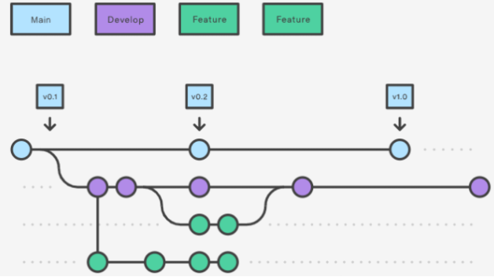

# A306 SubPJT01

## 아이디어(주제)

마인드맵

https://miro.com/welcomeonboard/V1dUSk1mZTZneTh1RDVnSmwzdmxBZVdNUlZvYURBSEY3djE3MHNlT1pFOXpuY01jbGlBUE4wVFRWTEZRcDZDYnwzMDc0NDU3MzYzMTY3NDQ1ODQz

1. 쇼핑
2. 여행
3. 운동

취업관련 사이트

- 차별성: 다트로 데이터분석을 한다.

- 잡싸피에서 나오는 데이터를 시각화

  

운동관련 사이트

- 식단계획
- 센터예약

네이버 쇼핑으로 왓쳐

영화 흥행했던 장르 보여주는 사이트

- crud 정도
- 위험할 수 있다 - 독특해서 고객들의 공감을 사지 못할 수도 있다.
- 유의미한 데이터를 보여줄 수 없을 수도 있다.
- 인기가 많았다를 보여주기엔 기준이 무엇일까?
- 영화 평점 비교 사이트 - 평점 객관화


**중간지점찾아주기**

- 필터
  - 번화가 - 맛집 밀집 지역
  - 거리상 중간
  - 지하철역
- 중간지점 뿐 아니라 방을 구할때도 대중교통등이 나올 수 있지 않을까?
- 개인정보보호기능
- 우리집에서 얼마나 걸리는지!
- 회원가입하면 길을 더 편하게 찾을 수 있게
- 하둡 - 맛집데이터?
- 당근마켓 올리브영 콜라보 - 올리브영에서 보자 캠페인
- 하둡으로 어떻게 시각화하지?
  - 추천까지 해주는 것(분류 알고리즘) - 나이, 성별에 맞게 - 이러면 필터가 명확해야한다. (맛집으로만 하는 것 고려)
  - 어느 지점 근처에 맛집이 얼마나 있는지?
- 중간지점이 장소가 나오는데 예를들면 양재역을 선택하면 반경에서 할 수 있는 것? 반경 500m이내에 할 수 있는 것 보여주기


## 기술 스택

### Backend

- spring boot (zulu 8)

### Frontend

- Vue.js (vue2)


## Git Convention

### **✅ Git Commit**

```css
type(옵션) / 역할 / 본문

ex) feat / BE / 로그인 함수 추가
```

- / (슬래시) 앞 뒤로 띄운다
- 본문은 구체적으로 작성한다.

### type 종류

- feat - 기능 추가
- fix - 버그 수정
- docs - 문서 수정
- style - 코드 포맷, 세미 콜론 누락 (로직 변경 x)
- refactor - 리팩토링
- test - 테스트 코드
- chore - 빌드 업무 수정 패키지 매니저 수정 (로직 변경 x)

### **✅ Git Flow**



- `master`: 제품으로 출시(배포)할 수 있는 브랜치
- `develop`: 다음 버전을 개발하는 브랜치
- `feature`: 단위별로 기능을 개발하는 브랜치 (완료되면 `develop` 브런치와 병합)

#### 브랜치 이름

```css
feature/ 역할/ 기능

ex) feature/BE/loginFunction
```

- 소스트리 사용
- 브랜치 만들 때 겹치지 않도록 소스트리 한번씩 확인하기.


## 기획마무리

### 기능

- 입력
  - 이름과 위치
  - 장소 찾을 때 연령 성별 데이터 받기 (안 적어도 서비스 사용 문제 없음)
- 지도
  - 중간거리찾기
    - 교통데이터 찾기
    - 중간거리찾기 알고리즘
    - 중간지점 나오는 지도 - 카카오 or T-map
    - 길찾기 결과
      - 지하철 역(거점지역은 추가)
      - 검색을 하면 여러개의 역이 보이고(역과의 거리, 걸리는 시간이 "간단"하게 나오기) - 하나의 역을 누르면 그 근처에 식당들이 보이게하면서 시각화도 같이!
      - 장소입력 - 카카오지도 나와서 ab 지도에 찍힘 - ab에 대한 중간지점 찾아내고 찾아낸 것을 카카오지도에 표시 - 카카오지도 길 찾기로 카카오지도에서 다시 하는것
  - 새로운 페이지가 아니라 지도 옆에 데이터를 띄우는 방법
    - 지도에 맛집을 띄울 때 색 또는 아이콘으로 구분 현재 선택 맛집: 밝은색 개인화 추천 맛집: 연한색 or 엄지 상관없이 맛집: 검은색
    - 지도에서 해당 맛집을 클릭하면 워드클라우드가 뜨게(해당 맛집 리뷰 내용)
- 데이터 시각화 페이지
  - 데이터 크롤링 (네이버 별점 데이터 or 카카오 별점 데이터)
  - 맛집추천 (코사인 알고리즘 등)
  - 데이터 시각화
    - 카테고리별로 연령/성별 선호 맛집 찾기 ex) 20대 여성은 떡볶이를 좋아해요
    - 연령/성별 안 지정한 경우 ex) 이 근처 식당은 국밥집이 인기가 많습니다.
    - 맛집추천(위에 나온 것 중 n개 추천) ex) 떡볶이가 나오면 떡볶이 맛집
    - 이 지역의 카테고리별 식당 순위 - 막대그래프/ 원그래프?도넛그래프? & 리스트
    - 평점 높은 카테고리별 식당 순위 (해당식당수/전체식당수 가 큰 것 추천 ex) 족발거리의 족발 여기 뭐가 유명하냐)
      - 1위 카테고리에 대한 추천맛집
      - 1위 카테고리 또는 추천맛집에 대한 워드클라우드
    - 음식점 리스트 - 리스트 기준(종류, 가격, 리뷰, 연령)
- 회원관리 (우선순위 ↓)
  - 카카오 로그인 - 이후 추가 정보(주소) 입력
  - 비회원일 경우 주소 입력 or 내 위치
  - 회원일 경우 주소입력 or 내 위치 or 친구만 추가하면 바로 중간거리 찾아주기
  - 친구추가 - 검색?
  - 회원이라면 집주소, 회사주소 여러개 저장 가능
  
  

### 역할

- 하둡 - 최대한 같이 배워보기
- 중간거리찾기 - 심재원, 김애은
- 데이터시각화 - 전예지, 김애은, 심재원, 문성호, 김명준
- BE - 심재원, 김애은, 전예지
- FE - 전예지, 김명준, 문성호, 심재원


### 창고

- 감성분석: 광고를 걸러내지 않으면 의미가 없으니 보류
- 최근에 갔던 식당 보여주기
- 메인 페이지에서 중간지점이 아니라 맛집 사이트처럼 생긴다 - 중간지점찾기는 부가적